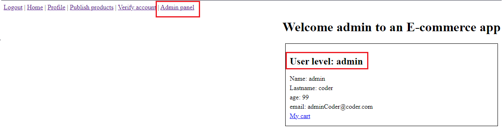
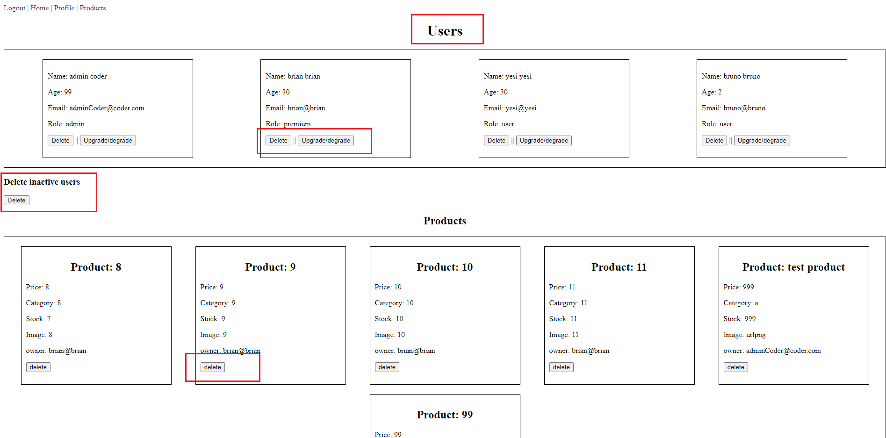
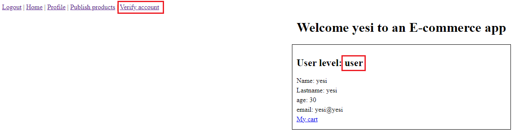
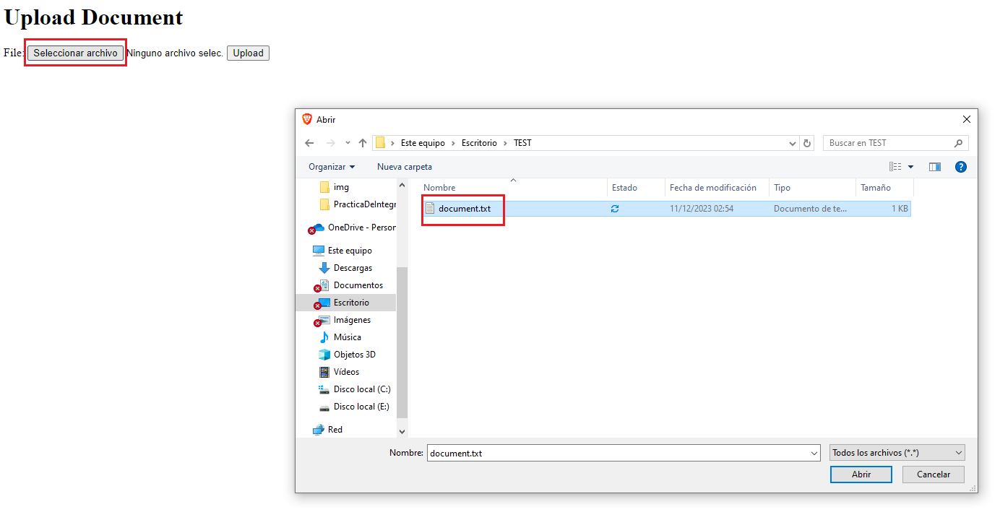
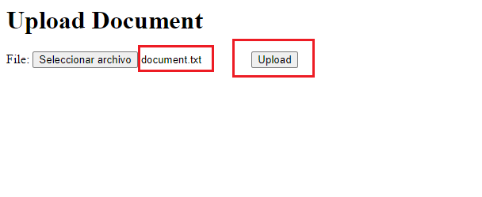

# Ingreso a panel de administrador

## Desde la barra de navegacion, una vez logueado como administrador, es posible acceder al panel de administrador.

## Desde el panel de administrador es posible gestionar los productos, usuarios y ademas borrar los usuarios que hayan permanecido inactivos por un tiempo previamente determinado

# Subir documentacion de ususario

## Desde la barra de navegacion es posible acceder a la seccion donde cargar la documentacion necesaria para el posterior cambio de usuario convencional a premium

